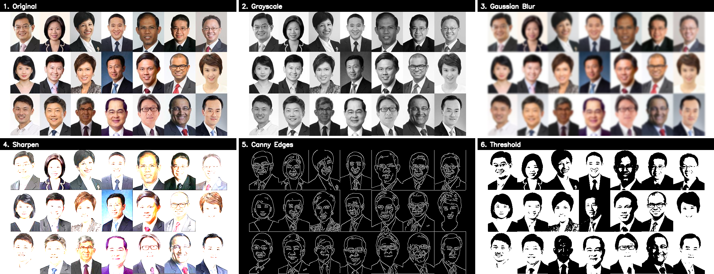

# Computer Vision: Image Filtering with OpenCV

I take one image and run six classic OpenCV filters over it, then stitch the
results into a single grid so you can compare them at a glance. It started as a
Colab notebook that only did blur and sharpen. I rebuilt it to run locally and
added grayscale, edge detection, and thresholding.

The original notebook used `drive.mount` and `cv2_imshow`, both Colab-only, so
this version drops them and reads the image straight off disk instead.

## Filters



1. **Original.** The input photo, a grid of headshots.
2. **Grayscale.** Color thrown away, brightness kept.
3. **Gaussian blur.** A 15x15 kernel averages each pixel with its neighbours, so detail goes soft.
4. **Sharpen.** A hand-written kernel pushes each pixel away from its neighbours, so edges pop.
5. **Canny edges.** Just the intensity boundaries, drawn as white lines on black.
6. **Threshold.** Every pixel snaps to pure black or pure white at a cutoff of 127.

## Run it

```bash
pip install opencv-python-headless numpy
python3 side_by_side.py
```

That reads `sc.jpg` from this folder and writes `comparison.png`. No Colab, no
Google Drive, no internet.

## Files

| File | Purpose |
|------|---------|
| `side_by_side.py` | Runs all six filters and builds the grid |
| `sc.jpg` | Input image |
| `comparison.png` | Generated output |

## The one idea worth remembering

Blur and sharpen are the same operation underneath. You slide a small matrix (a
kernel) across the image, multiply, and add up the result. Change the numbers in
the kernel and you change the effect. Average the neighbours and you get blur.
Subtract them and you get sharpening. That sliding-and-summing step is called
convolution, and it is the same math a CNN learns automatically instead of you
writing it by hand.

```python
sharpen_kernel = np.array([[0, -1, 0],
                           [1,  5, -1],
                           [0, -1, 0]])
sharpened = cv2.filter2D(image, -1, sharpen_kernel)
```

Two OpenCV quirks worth knowing. It stores color as BGR, not RGB — the opposite
channel order most libraries use. And `cv2.imread` returns `None` on a bad path
instead of raising an error, so the script checks for that and stops with a clear
message.

## Make it your own

Swap `sc.jpg` for any image, or change a filter by editing its kernel in
`side_by_side.py`. The sharpen kernel above is just nine numbers — bump the
center value for a harder edge, or shrink the `(15, 15)` blur kernel to soften
the effect less. Each filter is one `cv2` call, so adding a seventh is a one-liner.
